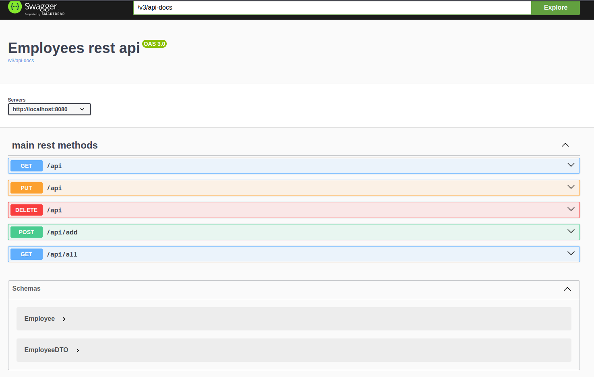

## http rest api

В данном проекте реализовано http rest api. Основные методы отвечают за управление данными в таблице 
работников в базе данных. Имеются следующие возможности:

- Поиск работника по id
- Изменение параметров работника по id
- Удаление работника по id
- Добавление работника по id
- Просмотр всех работников

По данным методам составлена документация:

Работоспособность проверена через Postman.